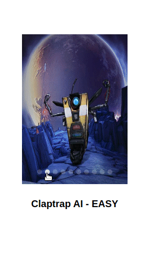
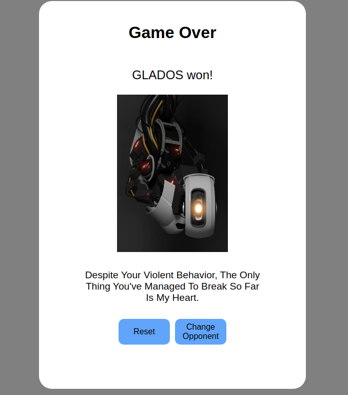
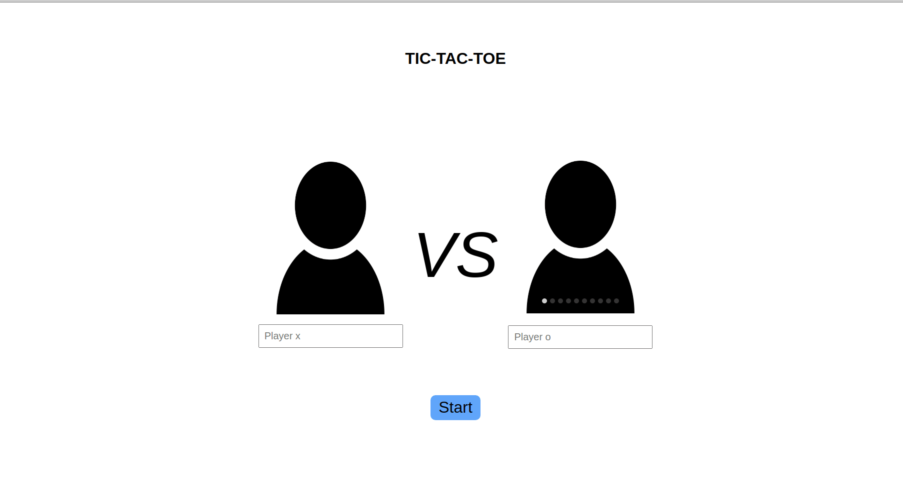

# Tic Tac Toe

Implementation of the famous game for the browser. Made with HTML, CSS and Javascript.

## Rules

Tic-tac-toe is played on a three-by-three grid by two players, who alternately place the marks X and O in one of the nine spaces in the grid.

There is no universally-agreed rule as to who plays first, but in this article the convention that X plays first is used. 

The player who succeeds in placing three of their marks in a horizontal, vertical, or diagonal row is the winner. It is a [solved game](https://en.wikipedia.org/wiki/Solved_game), with a forced draw assuming best play from both players.

## Features

The game is played either by two humans, or human vs ai. Human players can insert their names and select each move manually. Score is automatically kept track of.

AI players are divided in three groups of difficulty. The easy AI just chooses the first available spot to put their mark in. Normal AI will choose a random empty spot. Hard AI implements a [minimax algorithm](https://en.wikipedia.org/wiki/Minimax) to choose the optimal next move. As such, the hard AI is unbeatable, since optimal play from both players will lead to a draw.

AI Players are selected in the intro scene, and are loosely based in robots and AIs from various movies and games.

After either someone has won, or the game reaches a draw, the players can choose to either play again with the same opponent by pressing the `Reset` button or change opponent by pressing the `Change Opponent` button. If the second player was an AI the victory screen will include a quote, either celebrating their win or lamenting their loss.

## About

This page was made as part of the [Odin Project's curriculum](https://www.theodinproject.com/). It demonstrates the use of OOP patterns, such as modules and factory functions, applied to web development. The page was build using vanilla HTML5, CSS3 and Javascript.

## Demo

